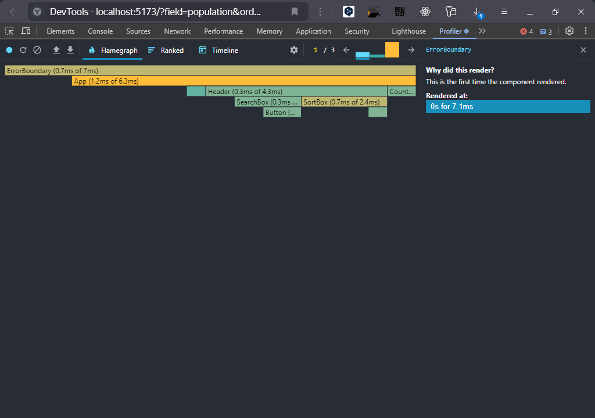
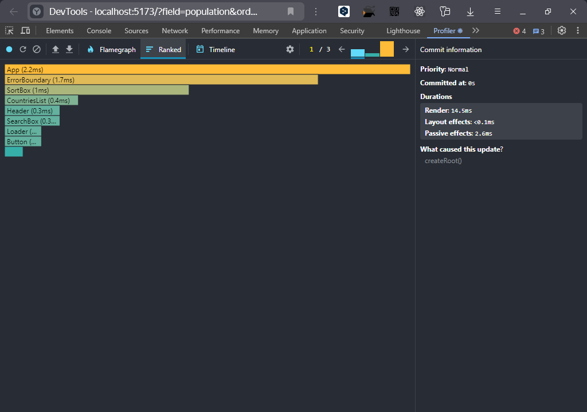
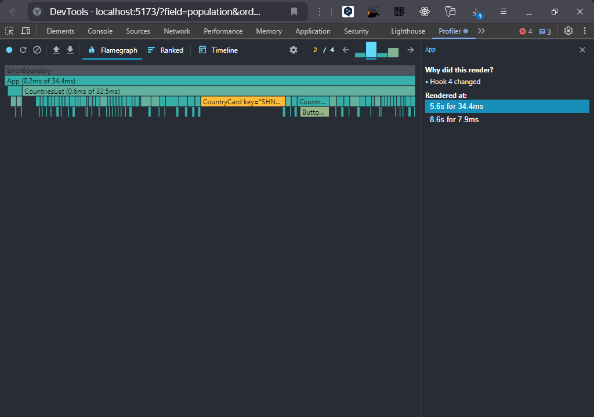
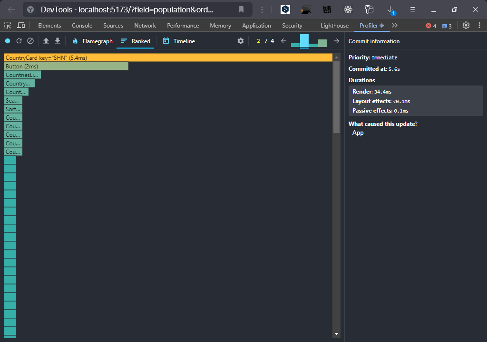
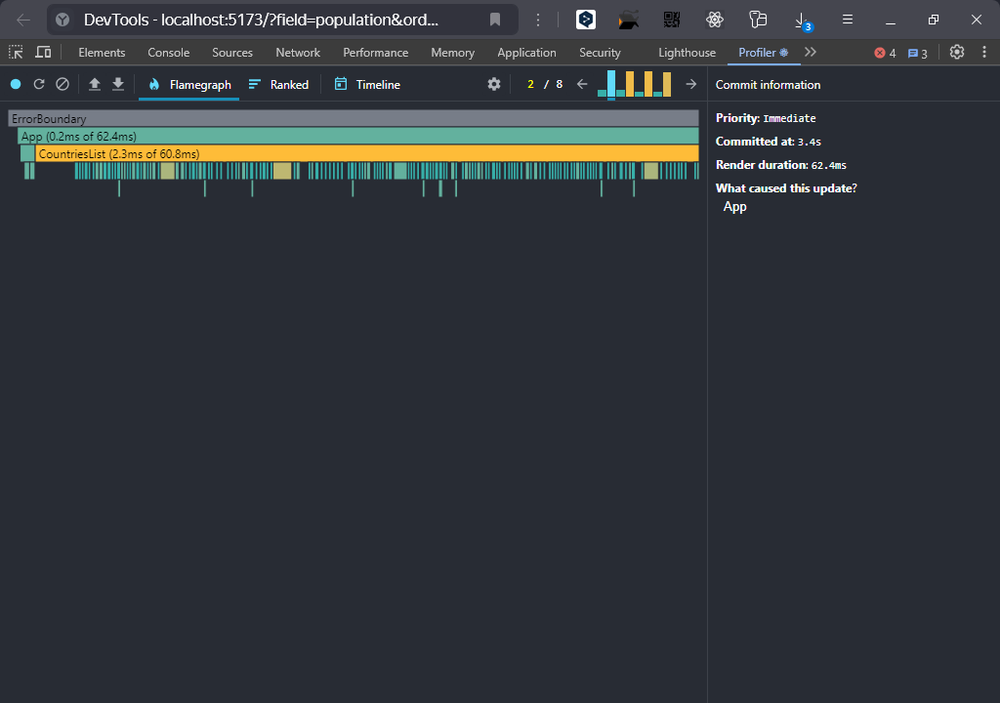
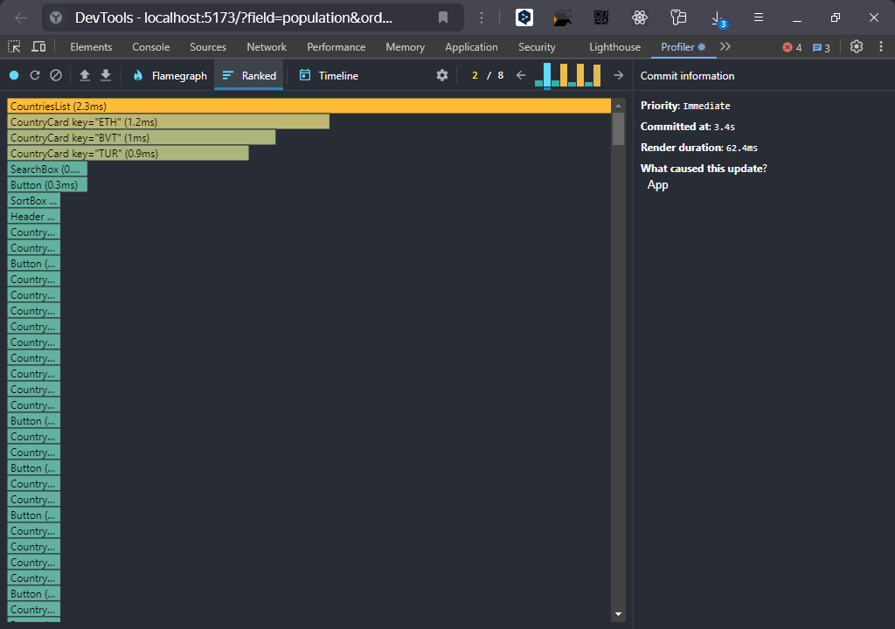

# RS School. React. 2025 Q1

#### Description

Simple demo-application that fetch country data from the [REST Countries API](https://restcountries.com/v3.1/all).
Created as a homework at course [React 2025 Q1](https://rs.school/courses/reactjs) for task #6 [React Performance](https://github.com/rolling-scopes-school/tasks/blob/master/react/modules/tasks/performance.md).

**Prerequisites**

Make sure you have the following installed on your machine:

- [Git](https://git-scm.com/)
- [Node.js](https://nodejs.org/en)
- [npm](https://www.npmjs.com/) (Node Package Manager)

**Cloning the Repository**

Clone the [repository](https://github.com/z-e-a/RS-React-2025Q1.git)

```bash
git clone  https://github.com/z-e-a/RS-React-2025Q1.git
cd RS-React-2025Q1
```

You are in the main branch now. Switch into the branch `performance`.

```bash
git switch performance
```
**Installation**

Install the project dependencies using npm:

```bash
npm install
```

**Running the Project**

```bash
npm run dev
```

Open [http://localhost:5173/](http://localhost:5173/) with your browser to see the result and test functionality.


#### Perfomance Profiling

##### Before optimizations

[profiler data](perfomance/1_before/data)

1. Initial load



2. Filter



3. Sort



